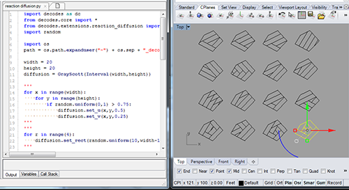

# decodes

> **NOTE:** this is a fork of the original [decodes](https://github.com/ksteinfe/decodes). The original repository seems to be abandoned and it does not contain any help or support. I managed to get some traces of the original [decod.es](decod.es) web site in [archive.org](https://web.archive.org/web/2018*/decod.es). I have updated/modified the original content to help other users to use the library.

## what is decodes?

decod.es is a a platform-agnostic geometry library, a common development environment, and a collaborative community that promotes computational literacy in architectural design.

decod.es is free, open-source, and built to seamlessly interface with a number of proprietary CAD packages, thereby opening computational design to students and independent designers who would otherwise be unable to afford expensive software licenses.

Inspired by the [Processing development environment](https://processing.org/), a programming community founded in 2001, this project seeks to transfer the gains achieved in the visual arts through the introduction of easily accessible computing to the unique needs of architects. By providing free and open access to computational design techniques, the Decodes project seeks to promote computational literacy in architects - a prerequisite for collaboration with a number of disciplines that are increasingly quantitative computationally adept, and essential to a contemporary and responsible practice of architecture.

**decodes is...**

**...a platform-agnostic geometry library**

Where most scripting languages are thin wrappers around complex software APIs, and often transfer much of the complexity of these APIs that get in the way of design thinking, decodes is built from scratch with designers in mind using nothing but pure [Python](https://www.python.org/).

**...a graphic approach to code**


**...a common development environment**

Computational design in architecture requires the ability to work between diverse and often incongruous descriptions of the built environment. The negotiation of these incongruous models is typically handled within scripts that interoperate across software platforms. To more effectively support design, Decodes provide mechanisms for easily operating within and between a range of host environments, as well as the ability to act independently of any host environment.




**...a community of contributors**

Available extensions include:

- cellular automata
- classical surfaces
- graphs
- lsystems
- packing
- EPW file parsing
- reaction-diffusion
- solar geometry
- two-dimensional tiling
- danzer tiling
- voxels

## Getting Started with Decodes

### Installation in Rhino

1. Download and install Rhino. **Note:** *decodes is originally developed for Rhino5 but I tested the example code in Rhino 6 and it works. This does not mean that everything will work*
2. Download decodes form [Releases](https://github.com/rubenbb85/decodes/releases) or from [master](https://github.com/rubenbb85/decodes/tree/master/src/decodes)
3. Unpack/move the folder *decodes* to ```C:\Users\**YOUR_USER**\AppData\Roaming\McNeel\Rhinoceros\6.0\Plug-ins\IronPython\settings\lib```
4. You should be ready to go.

### Rhino Python Editor

The Rhino Python editor is a built-in feature of Rhino 5.0, and offers a simple interface for writing Python scripts and visualizing the results in a 3d environment.

The first task of any script written in the Rhino-Python Editor will is to load the Decodes library into the scripting environment, as shown in the following two lines of code:

```python
import decodes as dc
from decodes.core import *
```

Once the context-specific environment has been setup in this way, the next task is to setup a way to translate Decodes geometry into Rhino geometry that may be “drawn” to the 3d space of our Rhino model. Creating an outie requires defining which CAD platform we're working in. This should be done near the top of each script, like so:

```python
outie = dc.make_out(dc.Outies.Rhino)
```

Taken all together, we might end up with a script that looks like the one below, in which a single red line is drawn to the 3d space of the CAD platform in which we are working:

```python
import decodes
from decodes.core import *

outie = decodes.make_out(decodes.Outies.Rhino)

vec_a = Vec(0,0,100)
pt_a = Point(2,3)
ln_a = Segment(pt_a, vec_a)
ln_a.set_color(1,0,0)
outie.put(ln_a)

outie.draw()
```

### Grasshopper

The Decodes Grasshopper component1 handles a number of tasks automatically, including the importing of the Decodes library, the translation of incoming Grasshopper geometry via input parameters, and the setting up of outies as called for by output parameters. Input and output parameters on the Decodes Grasshopper component are dynamic, meaning they may be added, removed, and renamed as required. Inputs Generally speaking, input parameters on the Decodes Grasshopper component behave the same way Grasshopper geometric objects passed into input parameters are automatically translated into the appropriate Decodes geometry when possible. Type hints for inputs may be set, but this happens through the grasshopper environment, before the python script executes. The 'list' flag may be set for inputs, which is graphically depicted by surrounding the name of the input parameter with square brackets ([x]). Outputs Taken all together, we might end up with a grasshopper component and script as shown below, which essentially reproduces the functionality of the Rhino-Python script shown above.

```python
ln_a = Segment(pt_a,vec_a)
ln_a.set_color(1,0,0)
out_a.put(ln_a)
```
